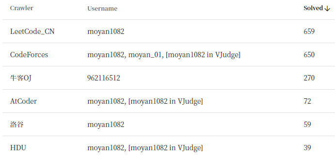

# Hey, MoYan1082 here! :wave:

About me:

- :laughing:I'm a competitive programming enthusiast.
- :star:I'm currently learning Computer Graphics.
- :low_brightness:I'm very interested in Deep Learning and Game Making.
- :package:Java for web applications, C++/Java/Python for competitive programming, Python for data science.
- :zap:In fact, I love programming and am doing what I want to do.

---

---
The problems in Online Judge solved by me is below:

